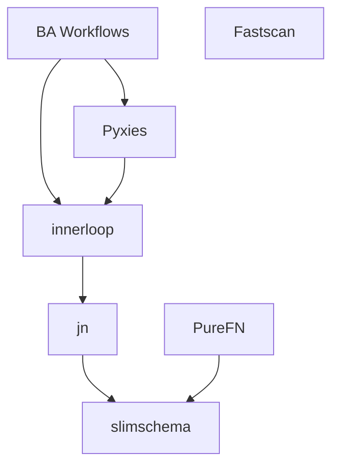

# Projects

BotAssembly is a collection of open source tools for building AI agents. Each project solves one problem well.

## Foundation Layer

Core building blocks that other tools depend on.

| Project | Description | Status |
|---------|-------------|--------|
| [**innerloop**](innerloop/index.md) | Agent loop SDK - execute/observe/decide cycle | Active |
| [**jn**](jn/index.md) | Agent-native ETL - NDJSON pipelines | Active |
| [**slimschema**](slimschema/index.md) | YAML schema system for data shapes | Active |

## Toolkit Layer

Specialized tools built on the foundation.

| Project | Description | Status |
|---------|-------------|--------|
| [**Pyxies**](pyxies/index.md) | Specialized agent loops (SenpaiKit, etc.) | Active |
| [**PureFN**](purefn/index.md) | Deterministic functional state for games | Active |
| [**Fastscan**](fastscan/index.md) | High-performance text scanning | Active |

## Application Layer

High-level tools for building complete solutions.

| Project | Description | Status |
|---------|-------------|--------|
| [**BA**](ba/index.md) | Bot Assembly - workflow language reference impl | Flagship |

## How They Fit Together

- **innerloop** provides the core agent loop that all agents use
- **jn** handles data transformation and protocol integration
- **slimschema** defines data shapes used across all tools
- **Pyxies** packages common agent patterns (like SenpaiKit) on top of innerloop
- **Fastscan** provides high-performance text scanning
- **BA** lets you define multi-step workflows using these building blocks
- **PureFN** provides deterministic state management for game-like scenarios
